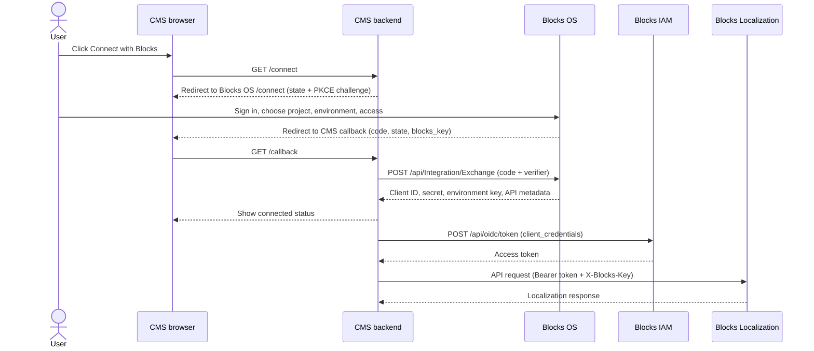

# Connect a CMS to Blocks OS

> **Try it live:** [https://os-cms-conection-production.up.railway.app](https://os-cms-conection-production.up.railway.app) — click **Connect with Blocks** and sign in with your Blocks account.

## 1. About this project

This repository is a small, runnable CMS stand-in: a React settings page and a Node/Express backend. It is the **reference implementation** of the "Connect with Blocks" integration. Everything a WordPress plugin, another CMS, or any server-backed application needs to connect to **Blocks Localization** is implemented here and working end to end:

- the browser redirect with PKCE and state,
- the one-time code → client credential exchange,
- server-side secret storage,
- access tokens from Blocks IAM,
- and Localization API calls within the granted permissions.

Use it to understand the contract, copy the pattern into a real plugin, or test a live Blocks deployment before building a production integration.

| Component | Responsibility |
| --- | --- |
| CMS browser | Show **Connect with Blocks**, follow the redirect, display connection status. |
| CMS backend | Create PKCE/state, validate the callback, exchange the code, store the credential, proxy API calls. |
| Blocks OS | Authenticate the user, let them choose project/environment/access, issue a one-time code. |
| Blocks IAM | Exchange the stored client credential for a short-lived access token. |
| Blocks Localization | Serve requests made with that token and the environment's `X-Blocks-Key`. |

The CMS **must have a backend**. The browser only starts the connection and receives the callback; the backend exchanges the code, stores the client secret, requests tokens, and calls Localization. Neither the secret nor an access token belongs in JavaScript, browser storage, or a URL.

## 2. How it's connected to Blocks



In short: **state + PKCE → Blocks OS connect screen → one-time code → Exchange → stored client credential → IAM token → Localization call**.

Two things to keep straight:

- The callback's `blocks_key` header is used **only** for the one-time Exchange call.
- The Exchange response's `xBlocksKey` identifies the selected environment and is used for all later IAM token and Localization calls.

The user picks the access level (Read or Full) on the Blocks OS screen. The CMS should trust the `templateKey` and `accessLevel` returned by Exchange, not what it suggested.

## 3. How to connect from your own CMS

The same five steps apply to WordPress, any other CMS plugin, or a custom server-backed client. Never call Exchange or IAM from browser JavaScript.

### Run this repo first

```bash
npm install
cp server/.env.example server/.env
# Edit server/.env for your deployment.
npm start
```

Open **http://localhost:8080/** and click **Connect with Blocks**. Or use the deployed instance at **https://os-cms-conection-production.up.railway.app** — built from the `Dockerfile` in this repository. Note that the stored connection is lost on every redeploy (reconnect after each one), and the harness has no authentication — remove the deployment when testing is done.

For reference, this repo's deployed instance uses these Blocks origins:

| Variable | Value | Meaning |
| --- | --- | --- |
| `BLOCKS_OS_URL` | `https://os.seliseblocks.com` | Blocks OS — the connect/approval screens and the Exchange API. |
| `BLOCKS_IAM_URL` | `https://iam.seliseblocks.com` | Blocks IAM — issues the access tokens used for Localization calls. |

### Step 1 — Configure your CMS

You need the Blocks OS origin, the Blocks IAM origin, and your own public callback URL (absolute HTTPS; plain HTTP only for `localhost`). Keep the callback URL stable — Exchange must receive the **exact same** `redirectUri` that started the flow.

In this repo that configuration lives in [`server/.env.example`](server/.env.example): `BLOCKS_OS_URL`, `BLOCKS_IAM_URL`, `APP_ORIGIN`, `PORT`, `SITE_NAME`, and optional `SUGGESTED_TEMPLATE`. The callback is `${APP_ORIGIN}/callback`.

### Step 2 — Start a connection

On your backend, generate a random `state` and a PKCE `code_verifier`, compute the S256 `code_challenge`, and store the attempt in a short-lived **server-side** session. Then redirect the browser to **Blocks OS** (`${BLOCKS_OS_URL}/connect`, e.g. `https://os.seliseblocks.com/connect`) with:

| Parameter | Value |
| --- | --- |
| `app` | `localization` |
| `redirect_uri` | Your exact callback URL. |
| `state` | The random value stored for this attempt. |
| `code_challenge` | The S256 challenge. |
| `code_challenge_method` | `S256` |
| `site_name` | Optional site label shown to the user. |
| `template` | Optional suggested access level. |

Implemented here in [`server/index.js`](server/index.js) at `GET /connect`.

### Step 3 — Receive the callback

Blocks OS handles sign-in, project/environment selection, and the access choice — your CMS doesn't build those screens. On success it redirects to your callback with `code`, `state`, and `blocks_key`. Validate `state` **before** trusting anything, then call from your backend, exactly once:

```http
POST /api/Integration/Exchange HTTP/1.1
Host: <blocks-os-host>            ← BLOCKS_OS_URL (e.g. https://os.seliseblocks.com)
Content-Type: application/json
X-Blocks-Key: <blocks_key from the callback>

{
  "code": "<one-time code from callback>",
  "codeVerifier": "<server-stored PKCE verifier>",
  "redirectUri": "<the exact original callback URL>"
}
```

The response contains `clientId`, `clientSecret`, `xBlocksKey`, `baseUrl`, `domain`, `templateKey`, and `accessLevel`. Store it **server-side** and never send the secret to the browser. This harness stores it in `server/.connection.json` ([`server/store.js`](server/store.js)) and shows only masked status in the UI ([`client/src/App.jsx`](client/src/App.jsx)).

### Step 4 — Call the API

When your CMS needs Localization data, its backend requests an access token from Blocks IAM and caches it until shortly before expiry:

```http
POST /api/oidc/token HTTP/1.1
Host: <blocks-iam-host>           ← BLOCKS_IAM_URL (e.g. https://iam.seliseblocks.com)
Content-Type: application/x-www-form-urlencoded
X-Blocks-Key: <xBlocksKey from Exchange>

grant_type=client_credentials&client_id=<url-encoded clientId>&client_secret=<url-encoded clientSecret>
```

Then call the Localization API — at the `baseUrl` returned by Exchange (e.g. `POST <baseUrl>/Key/Gets`), **not** either origin above — with both `Authorization: Bearer <accessToken>` and `X-Blocks-Key: <xBlocksKey>`. What each call may do depends on the access level the user selected.

### Step 5 — Map it to your platform

- **WordPress:** admin-only settings page + nonce-checked Connect action; state/verifier in a short-lived transient; callback as an authenticated `admin_post_...` route; `wp_remote_post()` for Exchange and API calls; credential stored as a non-autoloaded option.
- **Any other CMS:** the same responsibilities — protected admin action, server-side session/store, callback controller, server-side HTTP client, secrets store, token cache, status UI. The HTTP contract above doesn't change.

## 4. Conclusion

The "Connect with Blocks" contract is a short browser authorization step followed by server-only credential and API work: **state + PKCE → Blocks OS connect screen → one-time code → Exchange → stored client credential → IAM token → Localization call**. This repository implements that contract end to end and proves it against a live Blocks deployment; a production CMS plugin should keep the same sequence while replacing the harness's simple file storage and open routes with the CMS's own protected admin screens, session handling, and secrets infrastructure.
