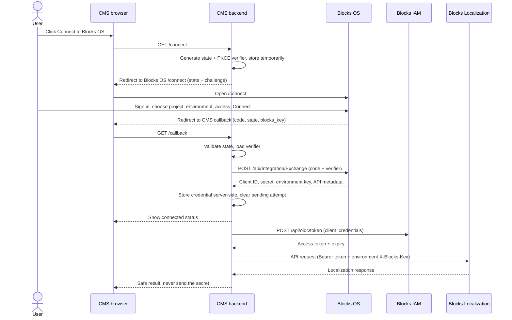

# Connect a CMS to Blocks OS

> **Try it live:** [https://os-cms-conection-production.up.railway.app](https://os-cms-conection-production.up.railway.app) — the deployed harness on Railway. Click **Connect with Blocks** and sign in with your Blocks account. See [Deployed instance (Railway)](#deployed-instance-railway) for configuration and caveats.

This repository is a small, runnable CMS stand-in: a React settings page and a Node/Express backend. It demonstrates how a WordPress plugin, another CMS, or any server-backed application connects a site to **Blocks Localization** through **Blocks OS Connect**. Use it to test the complete browser redirect, credential exchange, and Localization API flow before building a production integration.

The harness is **for local development and testing only**. It has no administrator authentication and stores one credential in a local plaintext file. The [Blocks OS developer guide](../blocks-os/docs/integration-connect.md) describes the server contract; this README shows how to implement and exercise it from the CMS side.

## 1. Introduction

Blocks OS Connect lets a person authorize a particular project, environment, and access level for an external site. The CMS receives a client credential for that environment, then obtains short-lived access tokens from Blocks IAM to call Blocks Localization. The available options come from the active IntegrationTemplates: `localization-read` and `localization-full` in the current seed.

The CMS **must have a backend**. Its browser only starts the connection and receives the callback; the backend exchanges the one-time code, stores the client secret, requests tokens, and calls Localization. Neither the secret nor an access token belongs in JavaScript, browser storage, or a redirect URL.

| Component | Responsibility |
| --- | --- |
| CMS browser | Show **Connect to Blocks OS**, follow the redirect, and display connection status. |
| CMS backend | Create PKCE/state, validate the callback, exchange the code, store the credential, and proxy API operations. |
| Blocks OS | Authenticate the person, let them choose a project/environment/access option, set up the integration, and issue a one-time code. |
| Blocks IAM | Exchange the stored client credential for a short-lived access token. |
| Blocks Localization | Serve requests made with that token and the selected environment's `X-Blocks-Key`. |

## 2. How it works



There are **two different Blocks keys** in this flow. The successful callback's `blocks_key` is used as the `X-Blocks-Key` header for the one-time **Exchange** call. The Exchange response's `xBlocksKey` identifies the selected environment and is used for subsequent **IAM token and Localization API** calls. Do not substitute one for the other.

The connect request expires after 60 minutes. The approval code expires after 5 minutes and can be exchanged only once. A failed exchange also consumes that code, so a fresh connection attempt is required after an exchange failure.

### Access levels

The person connecting the site chooses the final option in Blocks OS. The CMS can suggest one with the optional `template` parameter, but must use the `templateKey` and `accessLevel` returned by Exchange as the actual result. With the current [`integration-templates.json`](../blocks-os/server/seed/integration-templates.json), Read grants selected key-read operations; Full also grants key management, language save/default, module save/tag glossary, and glossary save/delete. Full does **not** grant language deletion or `Key/DeleteCollections`. The seed is the source of truth for the exact permissions, which can change independently of this harness.

## 3. Integrate step by step

These steps apply to WordPress, another CMS plugin, or a custom server-backed client. Do not call Exchange or IAM directly from a browser-only app.

### Step 1 — Prepare Blocks and the CMS

1. Deploy Blocks OS Connect, Blocks IAM, and Blocks Localization. Import/verify the integration permissions and active templates in the target Blocks configuration database. Set each template's `BaseUrl` to the **real** Localization API URL for that deployment; the seed's `https://<localization-host>` is only a placeholder.
2. Ensure the Blocks user can access the intended project/environment and has the applicable `blocks-os::integration::get` and `blocks-os::integration::save` permissions. Blocks OS also needs its configured IAM credential-management access to create the integration credential.
3. Configure your CMS with the Blocks OS origin, Blocks IAM origin, and its own public callback URL. The callback must be an absolute HTTPS URL without a fragment; plain HTTP is accepted only for `localhost` or `127.0.0.1`. Keep the callback URL stable: Exchange must send the **exact same** `redirectUri` used at the start.
4. Protect the CMS settings page and connection-start action with your normal administrator authorization and CSRF protection. Decide how your CMS will associate an in-progress attempt with the admin's session/site.

For this harness, copy `server/.env.example` to `server/.env` and set `BLOCKS_OS_URL`, `BLOCKS_IAM_URL`, `APP_ORIGIN`, `PORT`, `SITE_NAME`, and optionally `SUGGESTED_TEMPLATE`. The callback is `${APP_ORIGIN}/callback`; the default local origin is `http://localhost:8080`.

### Step 2 — Start a connection

On the CMS backend, generate a random `state` (16–512 characters) and a PKCE `code_verifier` (43–128 characters from `[A-Za-z0-9-._~]`). Compute `code_challenge = BASE64URL(SHA256(ASCII(code_verifier)))` without `=` padding. Store the verifier, state, original callback URL, initiating admin/site, and creation time in a short-lived **server-side** session/transient. The verifier never goes into the browser redirect.

Redirect the browser to `${BLOCKS_OS_URL}/connect` with URL-encoded parameters:

| Parameter | Value |
| --- | --- |
| `app` | `localization` |
| `redirect_uri` | Your exact callback URL. |
| `state` | The random value stored for this attempt. |
| `code_challenge` | The 43-character S256 challenge. |
| `code_challenge_method` | `S256` |
| `site_name` | Optional site label shown to the user; at most 100 characters. |
| `template` | Optional suggested key, such as `localization-read` or `localization-full`. |

The harness implements this in [`server/index.js`](server/index.js) at `GET /connect`. It uses a random HttpOnly session cookie to find the pending verifier after the browser returns and expires attempts after 10 minutes. A production CMS should use its own persistent, per-admin/site transient store and support the number of concurrent connections it allows.

### Step 3 — Let the user choose in Blocks OS

Blocks OS handles sign-in, project creation/selection, environment selection, readiness, and the visible **Connect** options. Your CMS does not need to recreate these screens. The user selects Read or Full; Blocks OS sets up the role and client credential, then redirects the browser to your callback.

On success the callback query contains `code`, `state`, and `blocks_key`. On cancellation it contains `error=access_denied` and `state`; expiry can return `error=expired`. The `code` is a one-time authorization code, **not** a client secret.

### Step 4 — Validate the callback and exchange the code

The CMS backend must look up the pending attempt, verify the authenticated admin/site context, and compare the returned `state` with the stored value using a constant-time comparison where available. Do this **before** trusting either success or error parameters. Reject missing or mismatched state, missing code/key, expired sessions, and duplicate callbacks. Show a safe error message and start a new attempt where appropriate.

Then call Blocks OS from the CMS backend, immediately and exactly once:

```http
POST /api/Integration/Exchange HTTP/1.1
Host: <blocks-os-host>
Content-Type: application/json
X-Blocks-Key: <blocks_key from the callback>

{
  "code": "<one-time code from callback>",
  "codeVerifier": "<server-stored PKCE verifier>",
  "redirectUri": "<the exact original callback URL>"
}
```

A successful response contains `clientId`, `clientSecret`, `xBlocksKey`, `baseUrl`, `domain`, `templateKey`, and `accessLevel`. Validate the required fields, store them **server-side**, bind them to the correct CMS site, and clear the temporary state/verifier. Show a connection-success message in the CMS. Do not log or display the secret. The harness stores one connection in `server/.connection.json` and returns only masked status to React.

### Step 5 — Obtain a token and call Localization

When the CMS needs Localization data, its backend requests an access token from Blocks IAM:

```http
POST /api/oidc/token HTTP/1.1
Host: <blocks-iam-host>
Content-Type: application/x-www-form-urlencoded
X-Blocks-Key: <xBlocksKey from Exchange>

grant_type=client_credentials&client_id=<url-encoded clientId>&client_secret=<url-encoded clientSecret>
```

Cache the returned `accessToken` until shortly before `expiresIn` elapses; do not fetch a token for every API operation. Call the API at the returned `baseUrl`, for example `POST <baseUrl>/Key/Gets`, with both `Authorization: Bearer <accessToken>` and `X-Blocks-Key: <xBlocksKey>`. Keep API calls on the CMS backend and expose only the result required by the CMS UI. Authorization depends on the template the user actually selected.

### Step 6 — Map the flow to WordPress or another CMS

For a **WordPress plugin**, the implementation normally looks like this:

1. Add an admin-only settings page and a **Connect to Blocks OS** action. Check `current_user_can('manage_options')` (or the capability your plugin defines) and verify a WordPress nonce on the action.
2. In the PHP handler, generate cryptographically random state/verifier, compute the S256 challenge, and store the attempt in a short-lived, per-admin/per-site transient or server session. Redirect to the configured Blocks OS `/connect` URL and `exit`.
3. Register a callback route such as an authenticated `admin_post_...` action. Require the same admin capability and session, load the attempt, compare state, then handle the callback error or perform `wp_remote_post()` to `/api/Integration/Exchange`. Use the original callback URL verbatim.
4. Validate the Exchange response and store the credential as a non-autoloaded, access-controlled option (`autoload` off). Protect the secret at rest according to your site's security model. Clear the transient and display an admin success/error notice. Do not expose the raw credential through a REST route, page HTML, or JavaScript.
5. For CMS features, use server-side `wp_remote_post()`/`wp_remote_request()` to obtain/cache an IAM token and call Localization with the environment key. On local disconnect, remove the stored credential and cached token; tell the admin that local deletion alone does not revoke the credential in Blocks OS.

For **another CMS**, map the same responsibilities to its equivalents: protected admin action, secure server-side session/store, callback controller, server-side HTTP client, secrets store, expiring token cache, and admin status UI. The HTTP parameters and security checks do not change.

## 4. Run and verify this harness

Requirements: Node.js 18+ and reachable Blocks OS, IAM, and Localization services with the integration data configured as above.

```bash
cd fake-cms-test-harness
npm install
cp server/.env.example server/.env
# Edit server/.env for your deployment.
npm start
```

Open **http://localhost:8080/** and click **Connect to Blocks Localization**. `npm start` builds the React client and serves it from the same origin as the callback. For frontend development, run `npm run build` once before `npm run dev`, then continue using port 8080 for the full redirect flow. Vite also serves a development UI on port 5175, but with the default `APP_ORIGIN` the callback returns to port 8080; that port needs a built client to display the result.

### Deployed instance (Railway)

A containerized instance of this harness is deployed at **https://os-cms-conection-production.up.railway.app** from the `Dockerfile` in this repository (multi-stage build: Vite client build, then a Node runtime that serves `client/dist` and the backend on port 8080).

Required Railway variables:

| Variable | Value |
| --- | --- |
| `APP_ORIGIN` | `https://os-cms-conection-production.up.railway.app` — must exactly match the public URL; Exchange rejects a `redirectUri` mismatch. Do not set `PORT`; Railway injects it. |
| `BLOCKS_OS_URL` | `https://os.seliseblocks.com` |
| `BLOCKS_IAM_URL` | `https://iam.seliseblocks.com` |
| `SITE_NAME`, `SUGGESTED_TEMPLATE` | Optional, as in `server/.env.example`. |

Railway-specific behavior and caveats:

- The container reaches the public Blocks OS and Blocks IAM deployments at `os.seliseblocks.com` / `iam.seliseblocks.com` server-to-server for Exchange and token calls, so no tunnel is needed for those services.
- `server/.connection.json` lives in the container filesystem and is **lost on every deploy or restart**; reconnect after each redeploy or mount a volume at `/app/server`.
- The warnings in section 5 apply fully: the harness has no authentication, so anyone with the URL can view status and trigger calls with the stored credential. Remove the deployment when testing is done.

Check the following with both Read and Full connections:

| Test | Read | Full |
| --- | --- | --- |
| `Key/Gets` | Allowed | Allowed |
| `Key/SaveKeys` with an empty list | `403` | Permission passes; API may return HTTP 200 with a validation message because no keys were supplied. |
| `Key/DeleteCollections` | `403` | `403` |
| Create a module through `Module/Save` | `403` | Allowed by the current template. |
| Add actual keys through `Key/SaveKeys` | `403` | Allowed, subject to normal validation. |

The **Add keys** form requires a module and language values. With Full access you can create a module in the harness first; with Read access the module-creation call should be denied. `Key/SaveKeys` can return HTTP 200 while reporting validation failure in its JSON body, so check `success` and `errorMessage`, not only HTTP status. Also test cancel (`access_denied`), an expired/mismatched state, and reconnecting. The exact permission list is in the current template seed, not hard-coded in the CMS.

Key harness routes:

| Route | Purpose |
| --- | --- |
| `GET /connect` | Create state/PKCE and redirect the browser to Blocks OS. |
| `GET /callback` | Receive the browser redirect and exchange the code server-to-server. |
| `GET /api/status` | Return safe connection metadata with a masked secret. |
| `POST /api/disconnect` | Forget the local credential only; it does **not** revoke it in Blocks OS/IAM. |
| `GET /api/test-calls`, `POST /api/test-call/:id` | Exercise permission boundaries. |
| `GET/POST /api/localization/modules` | List/create modules through Localization. |
| `GET /api/localization/languages` | List languages. |
| `POST /api/localization/keys` | Save keys and translations. |

The frontend calls only its own backend routes; it never calls Exchange, IAM, or Localization directly. [`server/store.js`](server/store.js) handles the harness's one-connection file persistence, and [`client/src/App.jsx`](client/src/App.jsx) is the test UI.

React renders API text as escaped text rather than injected HTML, and the backend caches IAM access tokens until shortly before their reported expiry. A WordPress plugin must implement its own output escaping and token cache; this harness does not modify the external plugin.

Run the callback regression test with `npm test -w server`. It starts a local-only harness server and checks cancellation state validation and replay handling.

## 5. Error handling and production considerations

| Situation | CMS behavior |
| --- | --- |
| User cancels (`error=access_denied`) | Verify state, clear the pending attempt, and show “Connection cancelled.” Keep any existing working connection. |
| Request expires (`error=expired`) or session is lost | Discard the pending attempt and offer **Connect again**. Do not reuse the verifier or code. |
| State mismatch or callback from a different admin/site | Reject without exchanging the code. Log only a redacted diagnostic; investigate possible CSRF/session mix-up. |
| Missing `code` or callback `blocks_key` | Reject and start a new attempt. |
| Exchange returns `invalid_code` or a network error | Do not blindly retry: the code is one-time, and you may not know whether Blocks OS already consumed it. Start a new connection. Preserve an existing credential until a replacement succeeds. |
| Blocks OS returns `request_not_found_or_expired`, `request_claimed_by_other_user`, or `request_not_pending` | Restart the flow with a fresh state/challenge. |
| Blocks OS reports `permissions_missing`, `template_invalid`, `iam_error`, or an unready environment | Show a non-secret error; confirm templates, IAM configuration, and project/environment readiness before retrying. |
| HTTP `429` / `rate_limited` | Back off; do not loop on redirects or token requests. |
| IAM token fails or Localization returns `401` | Invalidate the cached token and retry a token request once when appropriate. If credentials are revoked/rotated, ask an admin to reconnect. |
| Localization returns `403` | Do not silently switch to broader access. Show that the selected template lacks the operation; reconnect with Full only if the user chooses it. |
| Localization returns HTTP 200 with `success: false` | Surface the API's safe validation message; do not claim the write succeeded. |

For production, protect the settings UI and all CMS backend routes with authentication, authorization, and CSRF checks. Use HTTPS, Secure/HttpOnly/SameSite cookies where applicable, short-lived pending attempts, bounded request timeouts, secret-safe logs, and server-side secret storage. Support credential rotation and revocation: deleting a CMS option or calling this harness's local `/api/disconnect` does **not** revoke the Blocks IAM credential. An administrator must disconnect/regenerate it in the Blocks OS Integration page; already-issued access tokens can remain valid until expiry. Never put `clientSecret`, PKCE verifier, or bearer token in a URL, localStorage, HTML, or logs.

**Harness limitations:** `server/.connection.json` contains a live plaintext client secret (and is gitignored); `server/.env` is gitignored too. Pending attempts live only in memory and are pruned when a new connection starts, not by a background timer. Anyone who can reach this unauthenticated harness can trigger calls using the stored credential. Keep it local, do not deploy it publicly, and disconnect/revoke the test credential when finished.

## 6. Conclusion

The integration contract is a short browser authorization step followed by server-only credential and API work: **state + PKCE → Blocks OS Connect → one-time code → Exchange → stored client credential → IAM token → Localization call**. The harness proves that contract end to end; a production WordPress or CMS plugin should keep the same sequence while replacing its local in-memory/file storage and open routes with the CMS's protected admin and secrets infrastructure.
